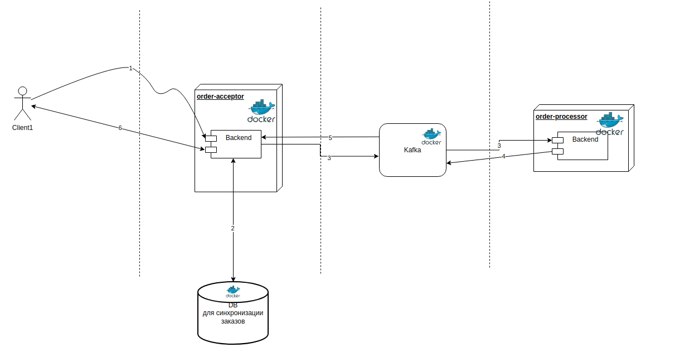

# Краткое содержание

Проект для обработки заказов. Реализована микросервисная архетектура для получения заказа на стороне order-acceptor и
передача на order-processor. Ниже диаграмма реализации workflow:



1) Прилетает заказ в order-acceptor
2) Генерируется id для заказа, заказ синхронизируется с DB
3) Передается в order-processor через Kafka
4) После обработки заказ возвращается в order-acceptor
5) См. 4-шаг, после получения сообщения order-accessor синхронизирует данные с DB
6) При получении запроса с нужным id, order-acceptor сообщает о готовности


## Запуск

```aiignore
./start-all.sh
```

Затем перейти по ссылке:
```aiignore
http://localhost:8080/swagger-ui/index.html
```